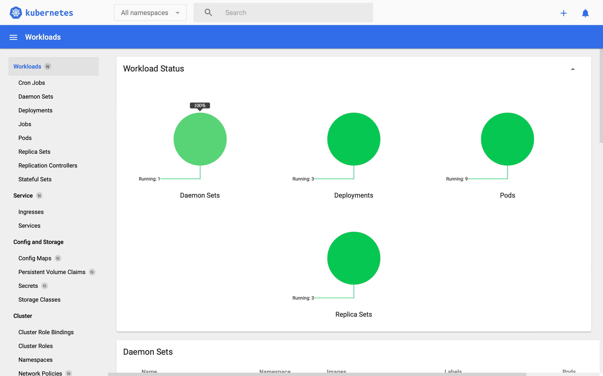

What’s up guys, this is Daniel! Yeah, this English blog is WRITTEN by me, not TRANSLATED by me! It’s my first English blog in my whole life. If you are a Chinese reader, maybe you’ve ever seen my Chinese blogs before. Right, I wrote a lot of blogs, but only in Chinese. Believe it or not, English isn’t my strong suit. But I want to have a try today and I’ll do my best. Let’s get started.

## What We Will Talk about Today

If you ask me how to create a local Kubernetes cluster, I'll tell you [Kind](https://kind.sigs.k8s.io), [minikube](https://minikube.sigs.k8s.io/docs/), and [Kubeadm](https://kubernetes.io/docs/setup/production-environment/tools/kubeadm/create-cluster-kubeadm/) are all good choices. If you ask me which tool is the most recommended for beginners, my answer must be `minikube` or `Kind`. `minikube` is more powerful than `Kind`, and `Kind` is easier than `minikube`.

In my previous article, I walked you guys through "How to Create a Local Kubernetes Cluster from the Ground Up" with `Kind`. If you are interested, here's a quick link for you:

- [Creating a Local Kubernetes Cluster from the Ground Up](/blog/local-k8s-with-kind#install-docker)

You might ask why that article is written by [Tiexin Guo](https://github.com/IronCore864), not me. Of course! As I said in the beginning, this blog you are reading now is my first English blog. So, technically, the one above isn’t “my” article, but I did write the Chinese version of it:

- [从零开始快速搭建本地 Kubernetes 测试环节](https://www.devstream.io/zh/blog/local-k8s-with-kind)

Both `minikube` and `Kind` are the most well-known and popular choices to run a Kubernetes environment on a local computer. Since I've shown you how to use `Kind`, I might as well introduce `minikube` to youadorable today.

## Quick Start with `minikube`

`minikube` is a command-line tool like `Kind` that you can use to create and configure Kubernetes clusters locally on your computer. 

### How to Install `minikube`

If your computer is the same as mine, Mac with m1 chip, you can install the latest `minikube` stable release in 2 steps:

```sh
curl -LO https://storage.googleapis.com/minikube/releases/latest/minikube-darwin-arm64
sudo install minikube-darwin-arm64 /usr/local/bin/minikube
```

If you are using `Homebrew`, just one command:

```sh
brew install minikube
```

If your computer is of other platforms or architectures, see the “Installation” section in [minikube start](https://minikube.sigs.k8s.io/docs/start/) for more details.

### `minikube start`

Like the section title we used here, to start using minikube, run `minikube start`:

```sh
$ minikube start
😄  minikube v1.25.2 on Darwin 12.2.1 (arm64)
👎  Unable to pick a default driver. Here is what was considered, in preference order:
    ▪ docker: Not healthy: "docker version --format {{.Server.Os}}-{{.Server.Version}}" exit status 1: Cannot connect to the Docker daemon at unix:///var/run/docker.sock. Is the docker daemon running?
    ▪ docker: Suggestion: Start the Docker service <https://minikube.sigs.k8s.io/docs/drivers/docker/>
💡  Alternatively you could install one of these drivers:
    ▪ hyperkit: Not installed: exec: "hyperkit": executable file not found in $PATH
    ▪ parallels: Not installed: exec: "prlctl": executable file not found in $PATH
    ▪ vmware: Not installed: exec: "docker-machine-driver-vmware": executable file not found in $PATH
    ▪ virtualbox: Not installed: unable to find VBoxManage in $PATH
    ▪ podman: Not installed: exec: "podman": executable file not found in $PATH

❌  Exiting due to DRV_DOCKER_NOT_RUNNING: Found docker, but the docker service isn't running. Try restarting the docker service.
```

Ok, it doesn’t matter; we need to install Docker. In my previous article [How to Create a Local Kubernetes Cluster from the Ground Up](/blog/local-k8s-with-kind#install-docker), I introduced how to "Install Docker".

After the Docker is installed, what we'll need in total?

- A not too bad computer;
- Internet connections;
- Container or virtual machine hypervisor, such as: Docker, Hyper-V, KVM, VirtualBox, or VMware Workstation ...

Let's try to run `minikube start` again. This command is time-consuming the first time you use it, especially if the network speed is low. Feel free to have a cup of coffee then come back to see the result.

2000 years later...

Well Done! 0 error, 0 warning! The logs are beautiful!

```sh
$ minikube start
😄  minikube v1.25.2 on Darwin 12.2.1 (arm64)
✨  Automatically selected the docker driver
👍  Starting control plane node minikube in cluster minikube
🚜  Pulling base image ...
💾  Downloading Kubernetes v1.23.3 preload ...
    > preloaded-images-k8s-v17-v1...: 419.07 MiB / 419.07 MiB  100.00% 8.54 MiB
    > index.docker.io/kicbase/sta...: 28.23 MiB / 343.12 MiB  8.23% 1.34 MiB p/
    > index.docker.io/kicbase/sta...: 343.12 MiB / 343.12 MiB  100.00% 3.77 MiB
❗  minikube was unable to download gcr.io/k8s-minikube/kicbase:v0.0.30, but successfully downloaded docker.io/kicbase/stable:v0.0.30 as a fallback image
🔥  Creating docker container (CPUs=2, Memory=3885MB) ...
🐳  Preparing Kubernetes v1.23.3 on Docker 20.10.12 ...
    ▪ kubelet.housekeeping-interval=5m
    ▪ Generating certificates and keys ...
    ▪ Booting up control plane ...
    ▪ Configuring RBAC rules ...
🔎  Verifying Kubernetes components...
    ▪ Using image gcr.io/k8s-minikube/storage-provisioner:v5
🌟  Enabled addons: storage-provisioner, default-storageclass

❗  /usr/local/bin/kubectl is version 1.21.5, which may have incompatibilites with Kubernetes 1.23.3.
    ▪ Want kubectl v1.23.3? Try 'minikube kubectl -- get pods -A'
🏄  Done! kubectl is now configured to use "minikube" cluster and "default" namespace by default
```

### Access Your Shiny Kubernetes Cluster

Do you have `kubectl` installed? If yes, you can now use it to access your shiny Kubernetes cluster:

```sh
$ kubectl get pod -A
NAMESPACE     NAME                               READY   STATUS    RESTARTS        AGE
kube-system   coredns-64897985d-hdmqd            1/1     Running   0               3m10s
kube-system   etcd-minikube                      1/1     Running   0               3m24s
kube-system   kube-apiserver-minikube            1/1     Running   0               3m25s
kube-system   kube-controller-manager-minikube   1/1     Running   0               3m25s
kube-system   kube-proxy-nkzmn                   1/1     Running   0               3m10s
kube-system   kube-scheduler-minikube            1/1     Running   0               3m23s
kube-system   storage-provisioner                1/1     Running   1 (2m40s ago)   3m22s
```

Alternatively, `minikube` can download the appropriate version of `kubectl` with the command `minikube kubectl`:

```sh
minikube kubectl -- get pod -A
    > kubectl.sha256: 64 B / 64 B [--------------------------] 100.00% ? p/s 0s
    > kubectl: 52.82 MiB / 52.82 MiB [--------------] 100.00% 6.04 MiB p/s 8.9s
NAMESPACE     NAME                               READY   STATUS    RESTARTS       AGE
kube-system   coredns-64897985d-hdmqd            1/1     Running   0              4m32s
kube-system   etcd-minikube                      1/1     Running   0              4m46s
kube-system   kube-apiserver-minikube            1/1     Running   0              4m47s
kube-system   kube-controller-manager-minikube   1/1     Running   0              4m47s
kube-system   kube-proxy-nkzmn                   1/1     Running   0              4m32s
kube-system   kube-scheduler-minikube            1/1     Running   0              4m45s
kube-system   storage-provisioner                1/1     Running   1 (4m2s ago)   4m44s
```

Cooooool!

Are you thinking this command is too complicated? Use the config below and you'll be happy:

```sh
alias kubectl="minikube kubectl --"
```

I'm used to command-line to access the Kubernetes cluster. Yes, I never use the Kubernetes Dashboard. But if you like to have some insight into your cluster state with a Dashboard, `minikube` bundles it for you:

```sh
$ minikube dashboard
🔌  Enabling dashboard ...
    ▪ Using image kubernetesui/dashboard:v2.3.1
    ▪ Using image kubernetesui/metrics-scraper:v1.0.7
🤔  Verifying dashboard health ...
🚀  Launching proxy ...
🤔  Verifying proxy health ...
🎉  Opening http://127.0.0.1:51801/api/v1/namespaces/kubernetes-dashboard/services/http:kubernetes-dashboard:/proxy/ in your default browser...
```

At this time, your browser will automatically open a new tab, and the Dashboard will soon show up:



### Deploy an Application in Your Shiny Kubernetes Cluster

Let’s create a sample deployment with the image `preslavmihaylov/kubehelloworld:latest` and expose it on port 3000.

The [minikube start](https://minikube.sigs.k8s.io/docs/start/) told us to use the `k8s.gcr.io/echoserver:1.4` to launch the `hello-minikube` application, but it'll fail on a Mac with m1 chip. See [this issue](https://github.com/kubernetes/minikube/issues/11107) for more details. 

```sh
$ kubectl create deployment sample-deploy --image=preslavmihaylov/kubehelloworld:latest
deployment.apps/sample-deploy created
$ kubectl expose deployment sample-deploy --type=NodePort --port=3000
service/sample-deploy exposed
$ kubectl get pod
NAME                             READY   STATUS    RESTARTS   AGE
sample-deploy-795887588d-flkgb   1/1     Running   0          50s
$ kubectl get svc
NAME            TYPE        CLUSTER-IP     EXTERNAL-IP   PORT(S)          AGE
kubernetes      ClusterIP   10.96.0.1      <none>        443/TCP          66m
sample-deploy   NodePort    10.107.59.38   <none>        3000:32631/TCP   43s
```

Then we can use `kubectl` to forward the port:

```sh
$ kubectl port-forward service/sample-deploy 3000:3000
Forwarding from 127.0.0.1:3000 -> 3000
Forwarding from [::1]:3000 -> 3000
```

Open the browser, visit `localhost:3000`, and "Hello World!" will soon show up.

Another way to access this service is to use the `minikube service sample-deploy` command and minikube will launch a browser page for you with the right `url:port` address.

And we can use the command `minikube tunnel` to use the `LoadBalancer` type Service. Here is an example:

```sh
$ kubectl delete service sample-deploy
service "sample-deploy" deleted
$ kubectl expose deployment sample-deploy --type=LoadBalancer --port=3000
service/sample-deploy exposed
```

In another terminal window, start the tunnel to create a routable IP with the command `minikube tunnel`:

```sh
$ minikube tunnel
✅  Tunnel successfully started

📌  NOTE: Please do not close this terminal as this process must stay alive for the tunnel to be accessible ...

🏃  Starting tunnel for service sample-deploy.
```

Now you can use the `EXTERNAL-IP` to access the Service:

```sh
$ kubectl get svc
NAME            TYPE           CLUSTER-IP      EXTERNAL-IP   PORT(S)          AGE
kubernetes      ClusterIP      10.96.0.1       <none>        443/TCP          86m
sample-deploy   LoadBalancer   10.96.205.167   127.0.0.1     3000:31945/TCP   28s
$ curl 127.0.0.1:3000
Hello World!
```

## How to Manage the Cluster

I'll show you some commands here:

- `minikube pause` # Pause Kubernetes cluster without impacting any deployed resources.
- `minikube unpause` # Unpause the Paused Kubernetes cluster.
- `minikube stop` # Remember the `minikube start`? Need I say more?
- `minikube config set memory 20480` # Change the default memory limit (requires a restart).
- `minikube addons list` # Browse the easily installed Kubernetes addons catalog.
- `minikube start -p aged --kubernetes-version=v1.16.1` # Create a second cluster running an older Kubernetes version.
- `minikube delete --all` # Yeah, delete all, delete anything, delete all clusters.

That's all?

No! But if you want to know them all, I'll show you the [command docs here](https://minikube.sigs.k8s.io/docs/commands/).

## How to Push Images into a `minikube` Cluster

There are about 8 ways you can use to push images into a `minikube` cluster. And I'll show you the most useful two ways today.

### Push Images with the `cache` Command

- `minikube cache add [flags] [options]` # Add an image to local cache.

Cache? Yes, the image will be cached by minikube and automatically pushed into all clusters, not like the `Kind` method: `kind load docker-image <IMAGE> [IMAGE...] [flags]`.

Let's see how many sub-commands `cache` has:

```sh
$ minikube cache -h
Add, delete, or push a local image into minikube

Available Commands:
  add         Add an image to local cache.
  delete      Delete an image from the local cache.
  list        List all available images from the local cache.
  reload      reload cached images.
```

Easy, isn't it?

The only sub-command we need to talk about might be `reload`. If your image changed after you had cached it, you need to execute `minikube cache reload [flags] [options]`

E.g.:

- `minikube cache add alpine:latest` # Cache alpine:latest for all clusters.
- `minikube cache reload alpine:latest` # Reload alpine:latest if it's changed.
- `minikube cache list` # Display what images we have added to the cache.
- `minikube cache delete alpine:latest` # Just delete alpine:latest

### Pushing Directly to the In-Cluster Docker Daemon

If the image we want to use inside the `minikube` cluster is built locally instead of pulled from a registry, we can reuse the Docker daemon inside the `minikube` cluster. Yeah, we don’t have to build the image on our host machine and `cache` it; we can just build inside the same docker daemon inside the `minikube` cluster.

```sh
$ docker ps
CONTAINER ID   IMAGE                    COMMAND                  CREATED       STATUS       PORTS                                                                                                                                  NAMES
170fe8252660   kicbase/stable:v0.0.30   "/usr/local/bin/entr…"   6 hours ago   Up 6 hours   127.0.0.1:50981->22/tcp, 127.0.0.1:50982->2376/tcp, 127.0.0.1:50984->5000/tcp, 127.0.0.1:50985->8443/tcp, 127.0.0.1:50983->32443/tcp   minikube

$ eval $(minikube docker-env)
$ docker ps
CONTAINER ID   IMAGE                            COMMAND                  CREATED       STATUS       PORTS     NAMES
de4fedaf4ef0   preslavmihaylov/kubehelloworld   "docker-entrypoint.s…"   5 hours ago   Up 5 hours             k8s_kubehelloworld_sample-deploy-795887588d-flkgb_default_2e6b194a-bdc7-44cc-b455-91959a4206a9_0
d45474ce1888   k8s.gcr.io/pause:3.6             "/pause"                 5 hours ago   Up 5 hours             k8s_POD_sample-deploy-795887588d-flkgb_default_2e6b194a-bdc7-44cc-b455-91959a4206a9_0
...
```

What happened?

After the command `eval $(minikube docker-env)` is executed, `docker` accesses the docker daemon inside the `minikube` cluster! What's the secret with `minikube docker-env` command? Let's dig into it:

```sh
$ minikube docker-env
export DOCKER_TLS_VERIFY="1"
export DOCKER_HOST="tcp://127.0.0.1:50982"
export DOCKER_CERT_PATH="/Users/danielhu/.minikube/certs"
export MINIKUBE_ACTIVE_DOCKERD="minikube"

# To point your shell to minikube's docker-daemon, run:
# eval $(minikube -p minikube docker-env)
```

I don't think I need to explain more about what happened. And we can `build` against the Docker inside `minikube` now. Just execute a command like `docker build -t my-image:latest .`, `my-image:latest` is instantly accessible to the Kubernetes cluster. 

## How to …

Oops, there are many how-tos we could talk about, but I believe that you can start using `minikube` now. Maybe I'll talk about more how-tos next time. If you want to dive into `minikube` now, go ahead and study the [official documentation](https://minikube.sigs.k8s.io/docs/).

## Summary

Cool, I finished writing this blog, It's like opening Pandora's box; I love this feeling. Of course, I know this blog is at the primary-school-student level, but I believe I can do better and better.

Don’t forget to give a Like, Comment, and Subscribe! I’ll see you in the next article!
