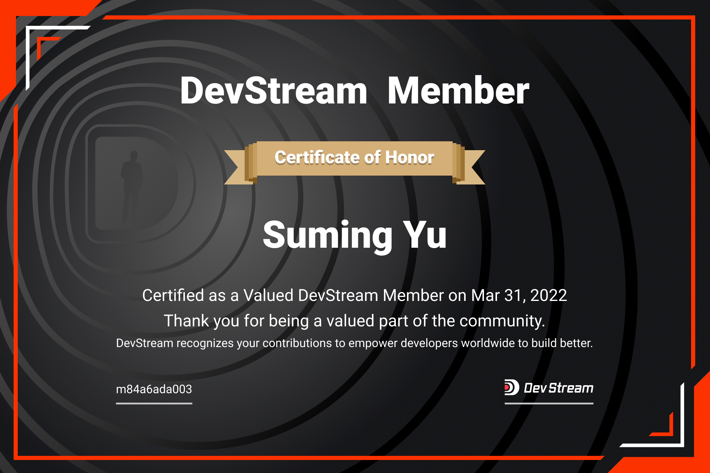

# DevStream New Members

Since the release of DevStream v0.1 in 2022 Mar, we have got quite some active contributors in just a month!

Issue / bug report / doc improvement / tech evangelism / bugfix / new feature ... all is welcome!

See our [certified contributors here](https://www.devstream.io/zh/blog/devstream-community-new-members/).

## New Members in 2022 Mar

After a vote within DevStream PMC, we've decided to invite Wu Xu, Suming Yu, Yingchu Chen, and Kaitian Xie to be the members of DevStream community!

---

### Wu Xu

---

### Yingchu Chen

---

### Suming Yu

---

### Kaitian Xie

---

### "Mug" Time

The Mugs are given to our members as a present. Here're a few of their personal photo shoots:

---

